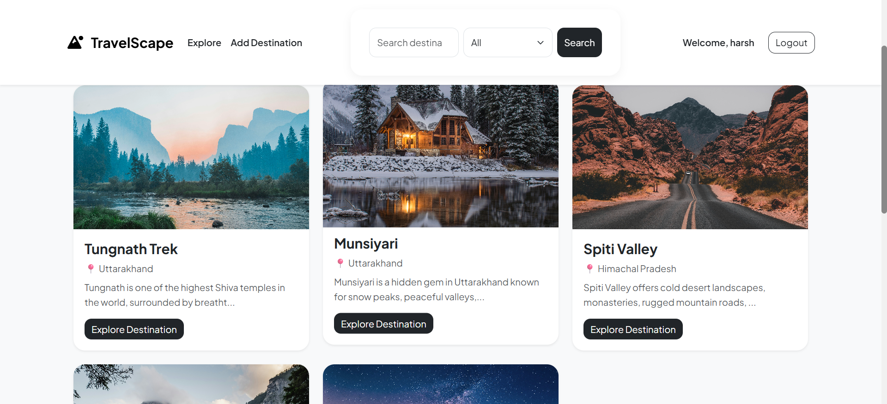
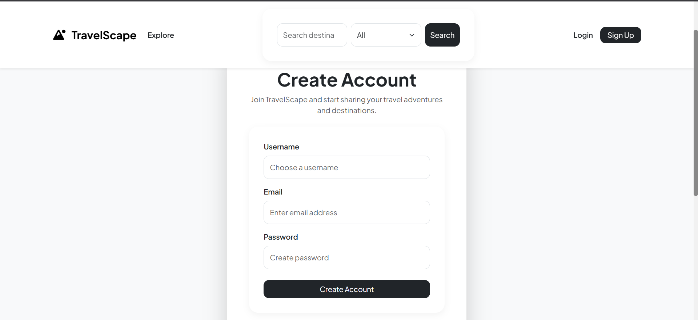
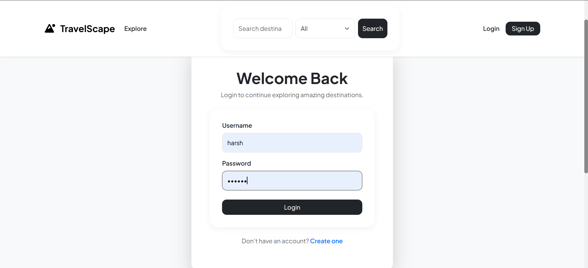
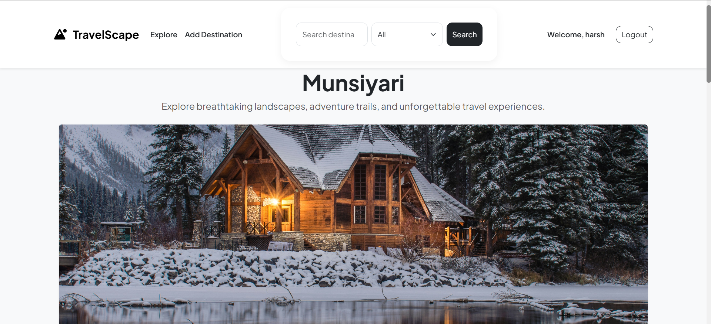
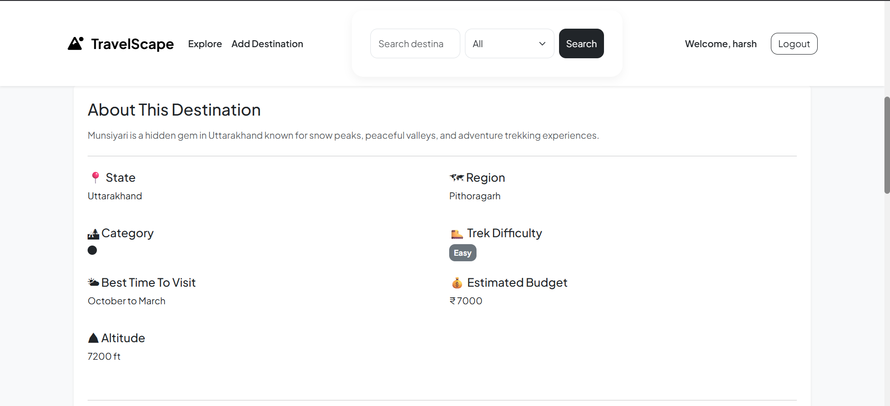
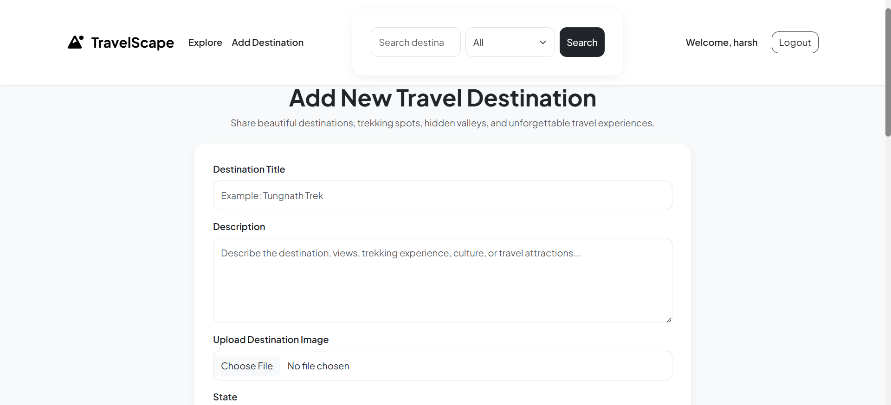
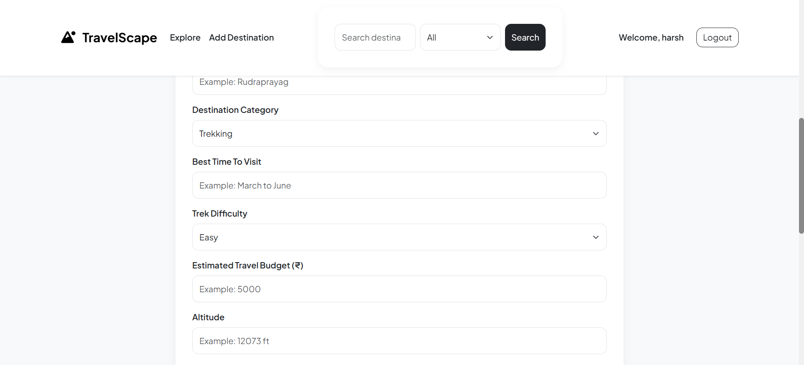
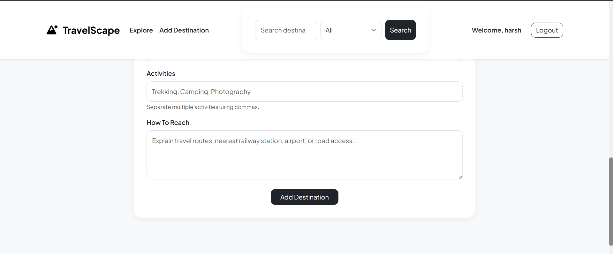
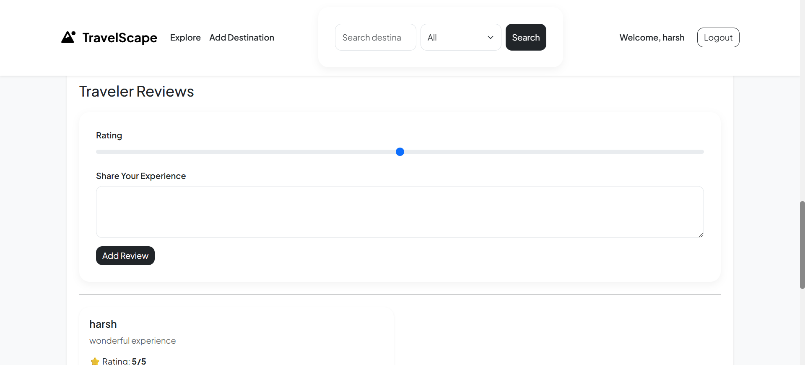

# 🗺️ TravelScape

TravelScape is a full-stack, server-rendered travel platform built on the MVC (Model-View-Controller) design pattern. It enables travel enthusiasts to explore breathtaking landscapes, share destination profiles, document trekking metrics, and read or write community reviews.

---

## 📸 Application Previews & Explanations

Here is a look at the system interfaces along with their operational explanations:

### 🏠 1. Home Page Explorer (`home-page.png`)



- **Explanation:** The landing view showcases travel destination cards (e.g., Tungnath Trek, Munsiyari, Spiti Valley) populated dynamically from MongoDB. It features global context searching by keyword/category and layout headers that conditionally change to show authenticated users (e.g., "Welcome, harsh") along with session controls.

### 🔐 2. Access Management (`signup.png` & `login.png`)

| Create Account                                                        | Welcome Back                                               |
| --------------------------------------------------------------------- | ---------------------------------------------------------- |
|                                      |                              |
| _Sign-up portal capturing Username, Email, and Password credentials._ | _Sign-in portal managing local passport-based validation._ |

- **Explanation:** Secure user onboarding and login flows managed via Passport.js local strategy authentication. The views include automated fields to match database schemas, allowing users to safely log in to unleash posting privileges.

### ⛰️ 3. Destination Detailed Views (`explore-place.png` & `explore-place1.png`)

| Header Overview                                          | Structural Metrics                                                          |
| -------------------------------------------------------- | --------------------------------------------------------------------------- |
|           |                            |
| _Displays destination images and introductory headings._ | _Grid view presenting metadata tracking difficulty, altitude, and budgets._ |

- **Explanation:** When a user selects a destination, the application displays dedicated property views. It renders structural metadata fields from the database layout—including State, Region, Category, Trek Difficulty badges (e.g., Easy), Best Time To Visit, Estimated Budget, and Altitude.

### ➕ 4. Add Destination Wizard (`add-listing.png`, `add-listing1.png`, `add-listing2.png`)





- **Explanation:** A multi-input multi-part creation form allowing authenticated hosts to submit fresh destinations. Captured schema values include Title, Description, Image files (uploaded to Cloudinary), Category, Best Time to Visit, Difficulty level, Budget, Altitude, Activities tags, and Route guidance.

### 💬 5. Review Portal (`add-reviews.png`)



- **Explanation:** An embedded interactive zone utilizing an HTML range slider to collect star ratings (1-5) and specific text area elements for community feedback. It displays previous submissions complete with timestamps and author headers.

---

## 🛠️ Technology Stack

- **Backend Engine:** Node.js & Express.js
- **Database Layer:** MongoDB via Mongoose Object Data Modeling (ODM)
- **View Engine:** Embedded JavaScript (EJS) templates
- **Authentication:** Passport.js with Local Mongoose Strategy
- **Validation Layer:** Joi validation schemas for robust data filtering
- **Media Optimization:** Cloudinary API integrated via `multer-storage-cloudinary`

---

## 📂 Codebase Directory Layout

TravelScape/
├── controllers/  
│ ├── listings.js  
│ ├── reviews.js  
│ └── users.js  
│
├── init/  
│ ├── data.js  
│ └── index.js  
│
├── models/  
│ ├── listing.js  
│ ├── review.js  
│ └── user.js  
│
├── public/  
│ ├── css/
│ │ ├── rating.css  
│ │ └── style.css  
│ └── js/
│ └── script.js  
│
├── routes/  
│ ├── listing.js  
│ ├── review.js  
│ └── user.js  
│
├── utils/  
│ ├── expressError.js
│ └── wrapAsync.js  
│
├── views/  
│ ├── includes/  
│ │ ├── flash.ejs  
│ │ ├── footer.ejs  
│ │ └── navbar.ejs  
│ ├── layouts/
│ │ └── boilerplate.ejs
│ ├── listings/
│ │ ├── edit.ejs  
│ │ ├── index.ejs  
│ │ ├── new.ejs  
│ │ └── show.ejs  
│ ├── users/
│ │ ├── login.ejs  
│ │ └── signup.ejs  
│ └── error.ejs  
│
├── screenshots/  
│ ├── add-listing.png
│ ├── add-listing1.png
│ ├── add-listing2.png
│ ├── add-reviews.png
│ ├── explore-place.jpg
│ ├── explore-place1.png
│ ├── home-page.jpg
│ ├── login.png
│ └── signup.png
│
├── app.js  
├── cloudConfig.js  
├── middleware.js  
├── schema.js  
├── .env  
├── .gitignore  
├── package-lock.json  
└── package.json

---

## 📊 Database Schemas Overview

### Destination Listing Schema[cite: 2]

- `title`: String (Required)[cite: 2]
- `description`: String[cite: 2]
- `image`: `{ url: String, filename: String }`[cite: 2]
- `state`: String[cite: 2]
- `region`: String[cite: 2]
- `category`: String[cite: 2]
- `trekDifficulty`: String[cite: 2]
- `bestTimeToVisit`: String[cite: 2]
- `estimatedBudget`: Number[cite: 2]
- `altitude`: String[cite: 2]
- `activities`: Array of Strings[cite: 2]
- `howToReach`: String[cite: 2]
- `reviews`: Array of ObjectIDs matching **Review**[cite: 2]
- `owner`: ObjectID referencing the **User**[cite: 2]

---

## 🚀 Local Installation & Run Guide

Follow these steps to set up and run the application locally on your machine:

### 1. Extract and Install Dependencies

Navigate inside the project root workspace directory and run npm setup[cite: 2]:

```bash
npm install

### 2. Configure Environment Matrix
Create a fresh .env environment layout document inside your main directory[cite: 2]:

Code snippet
CLOUD_NAME=your_cloudinary_cloud_name
CLOUD_API_KEY=your_cloudinary_api_key
CLOUD_API_SECRET=your_cloudinary_api_secret
SECRET=your_session_secret_passphrase

### 3. Clear & Seed Database Collections
Run the direct system initialization file to populate mock sample destinations into MongoDB[cite: 2]:

Bash
node init/index.js

### 4. Fire Up the Node Server
Run the boot script file to initiate the application process[cite: 2]:

Bash
node app.js

The application will boot successfully. Open your browser and explore the platform at http://localhost:8080
```
